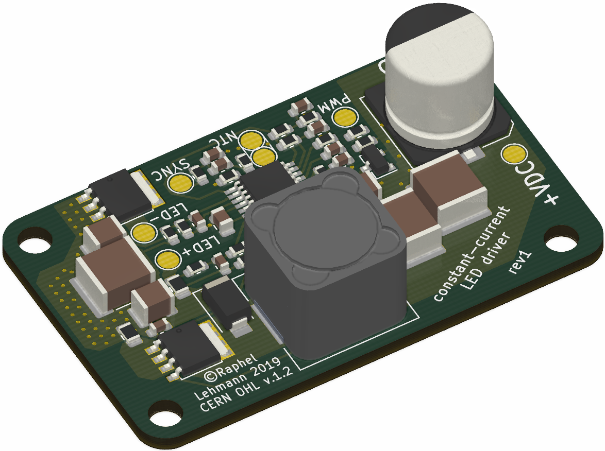

# Constant Current LED Driver

*WORK IN PROGRESS!*

Goal of this project is to design a constant current LED driver for high power LED modules.
To be able to use large LED modules (e.g. V_FW = 35V) or multiple modules in series boost topology is used.
The maximum output voltage is 75V to allow two 35V modules in series.

TIs [LM3424](http://www.ti.com/lit/ds/symlink/lm3424.pdf) chip is used in this design.

The current is adjustable, 827mA for the LED module [*Nichia NFCLJ108B-V1*](www.fairchip.com/pdf/Nichia/NFCLJ108B-V1.pdf)
and 389mA for [*Nichia NFCLL060B-V1*](https://lumstatic.com/Ke/DG/JkgO4GaB6Fu6ut0LEA.pdf) are testet.

To adjust the LED brightness a PWM input is available, that can be used for strobe light too.
Additionally multiple driver modules can be syncronized using the SYNC input.

In order to protect the LED from thermal destruction, the current is reduced from a temperature of 70°C until it is switched off at approx. 90°C (thermal foldback).
For this purpose an NTC (Vishay NTCLE100E3104JB0) can be attached to the LED.
If this feature is not required, a 100kΩ must be soldered in instead of the NTC.

Any 18V..20V (cheap) notebook power supply with a sufficient power rating can be used as an AC adapter.

## LED Driver PCB

### Specs
* Input: 12V to 24V
* Output: 9 LEDs at 827mA or 389mA
* 70°C - 90°C Thermal Foldback
* 1.5MHz Switching Frequency
* PWM Dimming up to 30 kHz (?)

## License

Copyright Raphael Lehmann 2019

Licensed under CERN OHL Version 1.2
